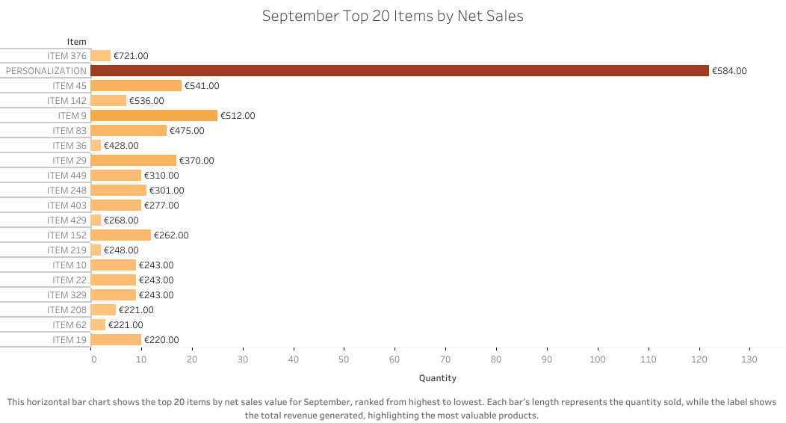

# 📊 Retail Sales Analysis — September 2025

## Data Analytics Project (Python, Pandas, Tableau, Excel)

### Project Introduction

In a real-world business scenario, I analyzed sales data from a Berlin store for September 2025, extracted from cloud-based business management software. To share the project publicly, I converted the dataset into a fully generic format while preserving its original structure and realistic retail characteristics.
Although this is a small yet in-depth analysis, the workflow and techniques used here can easily scale to larger datasets, multiple stores, and longer periods of time.

### Objective

The goal of this project was to produce a monthly sales report and uncover trends among the top 20 items by quantity sold and top 20 items by total net value.

### Data Preparation

The dataset consisted of 988 rows and 23 columns. I focused on the following key fields:

- **Item** — product name  
- **Quantity** — number of units sold per transaction  
- **Discount %** — discount percentage applied  
- **Price Unit Including VAT** — standard unit price  
- **Total discount** — monetary discount value applied  
- **Net price unit including VAT** — final amount paid by the customer  

The data was saved into Excel for easier exploration and then imported into Python.

## Exploratory Data Analysis

### Occurrences of Each Item

Some items appear multiple times in different transactions. To measure this, I created an Occurrences column:

**df['Occurrences'] = df.groupby('Item')['Item'].transform('size')**

Explanation: Groups the data by item name and counts how many times each item appears.

### Total Quantity per Item

Occurrences alone are not enough, so I added a Total Quantity column:

**df['Total Quantity'] = df.groupby('Item')['Quantity'].transform('sum')**

Explanation: Sums all quantities for each item and assigns the total to each row in that group.

### Top 20 Items by Quantity Sold

I grouped the data by item, summed the quantities, sorted results, and selected the top 20.

### Top 20 Items by Net Value

To calculate net revenue per item, I created a new column:

**df = df.assign(IndividualTotalValue=lambda x: x['Quantity'] * x['Price unit netto including VAT'])**

Then aggregated by item:

**top_20_items_value_netto = (
    df.groupby('Item', as_index=False)
      .agg({'Quantity': 'sum', 'IndividualTotalValue': 'sum'})
      .rename(columns={'IndividualTotalValue': 'Total Net Value'})
      .sort_values(by='Total Net Value', ascending=False)
      .head(20)
)**

Finally, formatted currency:

**top_20_items_value_netto['Total Net Value'] = (
    top_20_items_value_netto['Total Net Value']
    .apply(lambda x: f'€{x:,.2f}')
)**

## Conclusion

Sales data analysis plays a key role in supporting retail business strategies. It reveals trends, highlights best-selling products, and helps teams understand customer preferences. This guides communication, marketing, and in-store engagement.

In this example, the analysis shows a particularly strong performance in product personalization. Adding a personal touch to an item that the customer already wants creates extra value with only a small additional budget. This simple upgrade is having a noticeable impact, generating net revenue that is close to some of the store’s highest-priced products. With this information, both management, marketing efforts, and store teams can strengthen their storytelling, engage customers more meaningfully, and offer added value that benefits everyone.

Overall, this analysis shows how data helps align people, products, and business goals—supporting a more informed, responsive, and value-driven retail experience.

## Thank You for Visiting!

Thank you for taking the time to explore this project! Your interest and feedback are greatly appreciated. 🌟
If you have any questions or suggestions, feel free to reach out. Let's connect and collaborate! 🤝
