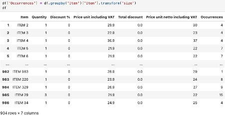

📊 Retail Sales Analysis — September 2025

Data Analytics Project (Python, Pandas, Excel)

Project Introduction

In a real-world business scenario, I analyzed sales data from a Berlin store for September 2025, extracted from cloud-based business management software. To share the project publicly, I converted the dataset into a fully generic format while preserving its original structure and realistic retail characteristics.
Although this is a small yet in-depth analysis, the workflow and techniques used here can easily scale to larger datasets, multiple stores, and longer periods of time.

Objective

The goal of this project was to produce a monthly sales report and uncover trends among the top 20 items by quantity sold and top 20 items by total net value.

Data Preparation

The dataset consisted of 988 rows and 23 columns. I focused on the following key fields:

Item — product name

Quantity — number of units sold per transaction

Discount % — discount percentage applied

Price Unit Including VAT — standard unit price

Total discount — monetary discount value applied

Net price unit including VAT — final amount paid by the customer

The data was saved into Excel for easier exploration and then imported into Python.

Exploratory Data Analysis

Occurrences of Each Item

Some items appear multiple times in different transactions. To measure this, I created an Occurrences column:

df['Occurrences'] = df.groupby('Item')['Item'].transform('size')

Explanation: Groups the data by item name and counts how many times each item appears.

